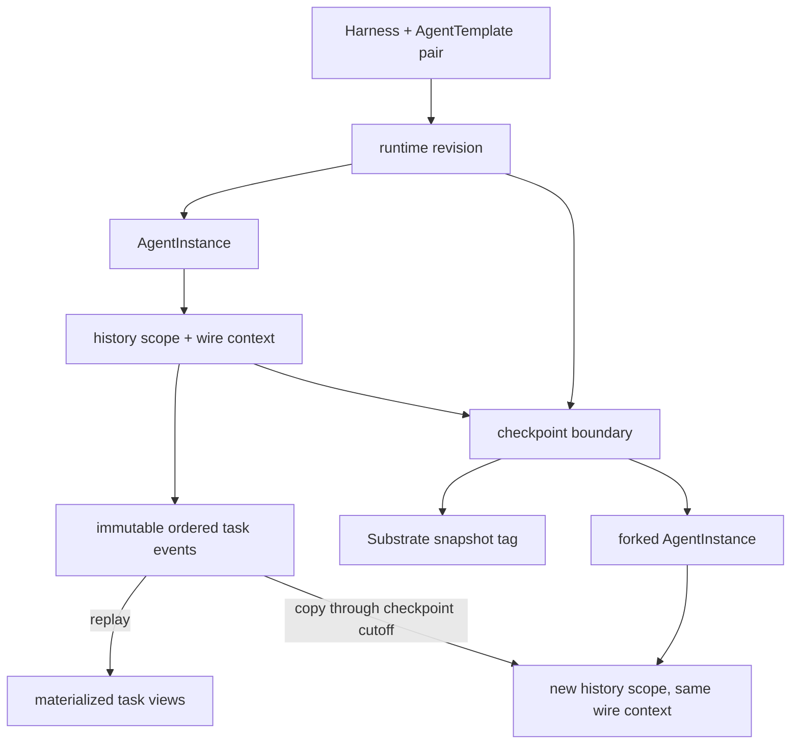

# Persistence, Checkpoints, and Forks

## Durable interaction model

`AgentInstance` represents ephemeral compute. An A2A context durably owns its
tasks and ordered events, allowing interaction history to remain as an audit trail
after compute is removed. New instances allocate independent instance, wire A2A
context, and durable history IDs. `agent_instance.history_id` selects the history;
`agent_instance.context_id` binds its public context. A composite foreign key
ensures that binding agrees with `a2a_context`. A history belongs to at most one
live instance, while multiple fork authorities may use the same wire context.

The core PostgreSQL records are:

| Record | Purpose |
| --- | --- |
| `runtime_revision` | Immutable compiled input and ate-api identity |
| `agent_template_harness_pair` | Pair status and latest successful revision |
| `agent_instance` | Compute identity, pinned revision, lifecycle phase, and Actor identity |
| `agent_instance_share` | Instance authorization grants |
| `a2a_context` | Durable history scope and its wire A2A context binding |
| `agent_instance_task` | Rebuildable current A2A task state and query indexes |
| `agent_instance_task_event` | Authoritative append-only task and message events, with creation and runtime-boundary metadata |
| `agent_instance_checkpoint` | Named immutable snapshot/history boundary |

Identity columns use PostgreSQL's native UUID type. Other framework-specific
tables are runtime implementation details, not part of this ownership model.

Instance, checkpoint, and share request IDs are validated as UUIDs by the gRPC
Protovalidate interceptor before handlers run. Services also validate IDs from
MCP and direct callers. The store passes SQL parameters safely and returns errors
for malformed IDs rather than panicking.

Parameterized SQL lives beside its owning store operation. When production code
and tests need the same query, they share a private helper accepting the existing
pool/transaction executor. Tests can inspect stored payloads through those helpers
without duplicating SQL. Transaction boundaries remain with the owning operation.

## Checkpoint creation

A checkpoint names a durable terminal boundary already recorded by the gateway.
Input-required and auth-required tasks are paused on their current node and are
not checkpointable or forkable; callers must resolve the interaction first.
Creating a checkpoint does not suspend the Actor again:

1. Reserve the checkpoint in PostgreSQL.
2. Verify that the suspended Actor still holds the external snapshot URI and scope recorded on the boundary.
3. Create a Substrate `Tag`, which copies the Actor's current snapshot into independent storage, and verify the source did not change during the copy.
4. Atomically persist the Tag UID and copied snapshot URI and mark the checkpoint ready.

The `CREATING` reservation blocks task admission and lifecycle changes until the
copy completes or cleanup finishes. A lost response can reuse a completed Tag;
an incomplete copy is deleted before the failed reservation is released. A
failed database finalization leaves the reservation and completed Tag for retry.
The gateway records boundaries without retaining every turn: only explicit
checkpoints survive subsequent suspends or source deletion.

The checkpoint retains source-instance provenance, source history, prepared
revision, name, head task, and history sequence. Reservation saves an event
cutoff in the same transaction as the runtime boundary reference. Later replies
append events beyond that cutoff and cannot change the saved task state.
The head identifies the task whose snapshot
covers the latest history event, including when an older paused task resumes. The source AgentInstance may be
deleted while its context and checkpoint remain.

Deletion first hides the checkpoint, then deletes its snapshot tag, then removes
the row. A checkpoint referenced by a fork cannot be deleted. Substrate deletes the Tag's copied snapshot with the Tag.

## Forking

Forking creates a new AgentInstance authority and durable history scope. It
preserves wire context, task, message, artifact IDs, and request deduplication
metadata while copying events through the saved cutoff and reconstructing task
views from those events. It never reads the source's current task views. It creates a
separate Actor from the checkpoint's snapshot tag. Private runtime session IDs and
opaque paused-tool references therefore remain valid without runtime-specific
rewriting. New work appends only to the fork's history; source history and the
checkpoint remain immutable. The copied head boundary
uses the retained Tag URI, allowing a fresh fork to be checkpointed before its
first turn. Fork creation verifies the Tag UID and URI as well as the Actor's
source Tag, suspended state, template, and external snapshot.

Checkpoint sharing is not implemented. Future sharing must be restricted to data
snapshots without process state.

The workflow lives in
[`go/core/internal/service/checkpoint`](../../go/core/internal/service/checkpoint).

Tasks have an immutable `position` independent of their opaque IDs and mutable
status timestamps. Listing and pagination use this position; forks preserve it.
New tasks append after inherited tasks, including through repeated forks.

Task creation records a full A2A Task event, its position, and request deduplication
metadata. Later events carry task snapshots or incremental status/artifact changes;
message-only replies also record their explicit status transition. Live persistence
and replay use the same protobuf reducer, preserving opaque fields in unchanged
subtrees. Event writes and task-view updates commit atomically. Runtime boundaries
are retained on their final task events so the task's snapshot index is rebuildable.

Forks copy the event payloads unchanged. Their final boundary references the retained
snapshot Tag, and event sequence references are rebound to the fork's event rows.
Checkpoint creation does not copy task views. Fork reconstruction costs a traversal
of the saved event history; malformed or incomplete history fails the fork transaction.

Authority-scoped snapshot cloning is a kagent contract; A2A does not specify
snapshot forks. A complete task address includes the instance route. Reads,
writes, cancellation, subscriptions, authorization, and deduplication remain
instance-scoped. A context or task ID alone never selects another branch.

## Unreleased schema

Until release, core schema changes are folded into `000001_initial.sql`.
Recreate development databases when that baseline changes; there is no upgrade
path from earlier development schemas. The Down migration removes the core schema.

Deploy the controller and clients together: clients must use `AgentInstance.context_id`
or omit the context and let the routed gateway resolve it.

## Malformed scheduling records

Cron reservation removes schedules with undecodable payloads or invalid scheduling
configuration from the due queue by clearing `next_execution_time`. Their bytes
remain intact, and an error log identifies each affected schedule. Repair requires
correcting the persisted payload and restoring its next execution time. Clearing
the queue entry prevents even a full batch of malformed rows from starving healthy
schedules; database write failures still roll back the transaction.

Execution leasing reports and skips individual malformed payloads, returning the
healthy leases from the same batch. The malformed records retain their existing
30-second lease delay and become eligible again after repair. Their runtime state
is not changed: a decoding error does not establish whether an actor has stopped.

Get and List continue to reject malformed payloads. An owner can still delete a
malformed schedule by ID: ownership and tombstoning use database columns, and the
response contains only ID, creator, creation/update timestamps, and deletion time.
It does not synthesize configuration or an etag from damaged bytes. Deletion retries
return the same tombstone, the original payload remains stored, and execution
history is retained. Valid schedules keep their existing full deletion response.
