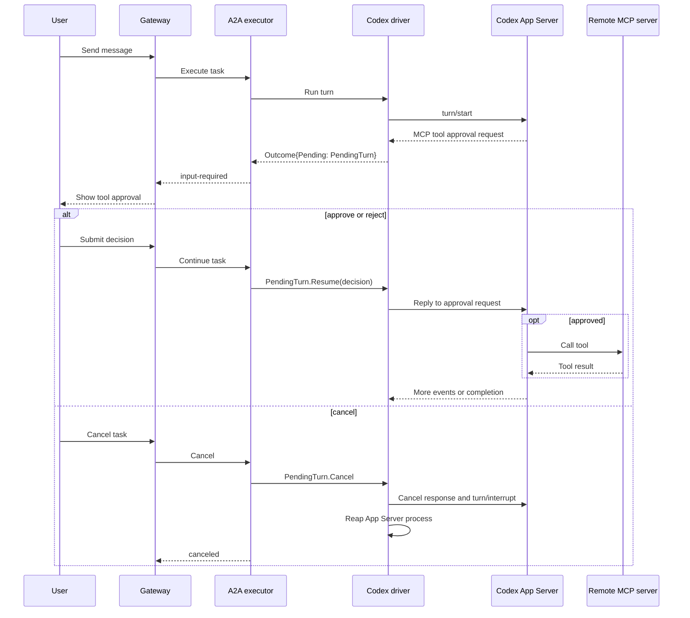

# Codex Harness

The Codex Harness compiles a `kagent.dev/v1alpha3` `AgentTemplate` into a
compiler-owned Codex configuration and runs one Codex App Server `0.148.0`
process for each public A2A Task. Its native thread and workspace are retained
in the Actor's `DurableDir`.

## Code structure

The controller and Actor share only the versioned config contract. Kubernetes
resolution stays in the controller; Codex App Server behavior stays in this
harness.

| Path | Look here for |
| --- | --- |
| [`../../core/internal/translator/codex`](../../core/internal/translator/codex) | Translating `Harness`, `AgentTemplate`, model, MCP, plugin, and Secret inputs into a runtime revision |
| [`config/config.go`](config/config.go) | The versioned JSON contract shared by the compiler and runtime, including defaults and validation |
| [`cmd/main.go`](cmd/main.go) | Actor startup, environment inputs, Codex version validation, continuation-store wiring, and private A2A startup |
| [`internal/adapter`](internal/adapter) | Materializing `CODEX_HOME`, native TOML, shared agents, skills, and MCP configuration |
| [`internal/driver`](internal/driver) | App Server lifecycle, JSON-RPC framing, event translation, thread resume, cancellation, and process supervision |
| [`protocol/schema`](protocol/schema) | Generated App Server schema used as a development reference; regenerate it from the pinned CLI rather than hand-editing it |

## Implemented support

- OpenAI through a Secret-backed API key, the Responses API, and an optional
  absolute HTTP(S) base URL.
- Amazon Bedrock through either `AWS_BEARER_TOKEN_BEDROCK` or standard AWS
  access-key credentials in one Secret.
- Streaming text, command and file activity, direct Streamable HTTP MCP (with
  allowed-tools selection), and native Shared agents.
- Per-server MCP tool approval with live App Server pause, resume, and cancel.
- Native ask-user questions in default mode
- Standalone and plugin-selected skills without plugin hooks, commands,
  executables, or implicit plugin MCP servers.
- Exact native thread resume and bounded cancellation through `turn/interrupt`.

The adapter deliberately fixes the native sandbox to `danger-full-access` and
approval policy to `never`; the Substrate Actor remains the security boundary.
MCP servers marked for approval still prompt through App Server elicitation.
Account login, API-key passthrough, custom TLS, legacy SSE MCP, Dedicated agents,
checkpoint/fork guarantees, and configurable native policy are not advertised.

Runtime configuration is supplied through `KAGENT_CONFIG_JSON` and
`KAGENT_AGENT_CARD_JSON`. Private A2A is served on port 80 and readiness on
`/readyz` at port 8081.

## Human-in-the-loop flow

An MCP binding with `requireApproval: true` is emitted with Codex's default
tool approval mode set to `prompt`; other configured MCP servers use `approve`.
The driver exposes only approval requests for the configured protected servers.
Although Codex transports these requests using the `mcpServer/elicitation/request` 
App Server method, the external MCP server is not performing MCP elicitation.



## Development

The Codex driver launches App Server and communicates with it using JSON-RPC
2.0. To refresh the reference schemas from the pinned Codex CLI, run:

```text
codex app-server generate-json-schema --out go/harness/codex/protocol/schema
```

For protocol details, see the [Codex App Server message
schema](https://learn.chatgpt.com/docs/app-server#message-schema).

## Example

```yaml
apiVersion: kagent.dev/v1alpha3
kind: Harness
metadata:
  name: codex-harness
  namespace: kagent
spec:
  codex: {}
  workload:
    image: ${KAGENT_CODEX_IMAGE_DIGEST}
  substrate:
    workerPoolRef:
      name: kagent-default
    snapshotPolicy:
      location: gs://ate-snapshots/kagent/
  allowedAgentTemplates:
    selector:
      matchLabels:
        kagent.dev/e2e-runtime: codex
---
apiVersion: kagent.dev/v1alpha3
kind: AgentTemplate
metadata:
  labels:
    kagent.dev/e2e-runtime: codex
  name: kagent-codex
  namespace: kagent
spec:
  description: test
  modelConfig:
    name: default-model-config # This modelconfig must have openAI.apiFormat set to "responses"
  systemPrompt: |
      Follow the selected skill and use the configured MCP tool.
  tools:
    - mcp:
        server:
          kind: RemoteMCPServer
          name: kagent-tool-server
  plugins:
    - source:
        git:
          url: https://github.com/agentplugins/agent-plugins-example.git
          commit: 5f3f5084a821aefa792e79500dd8f0462ab83473
      skills:
        - migrate-agent-plugin
```
